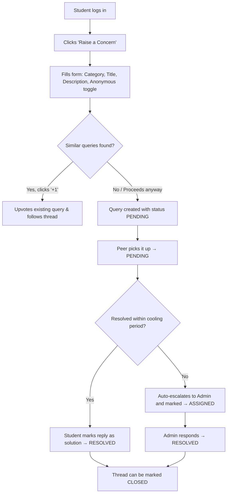
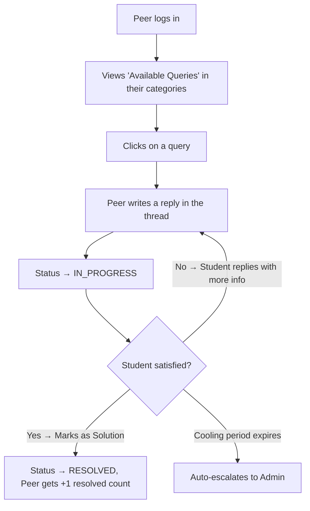
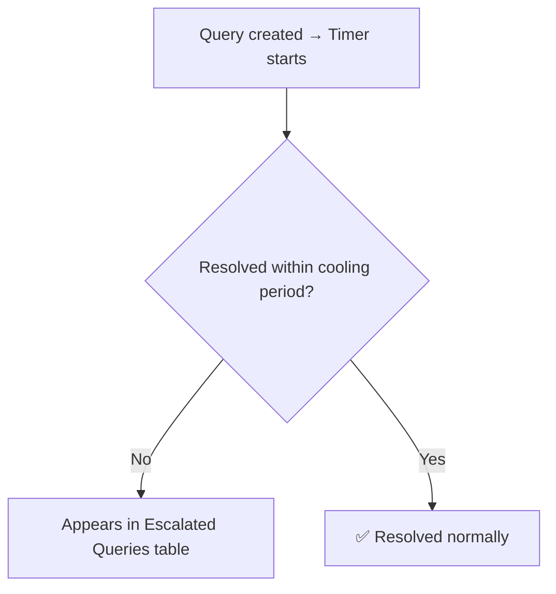
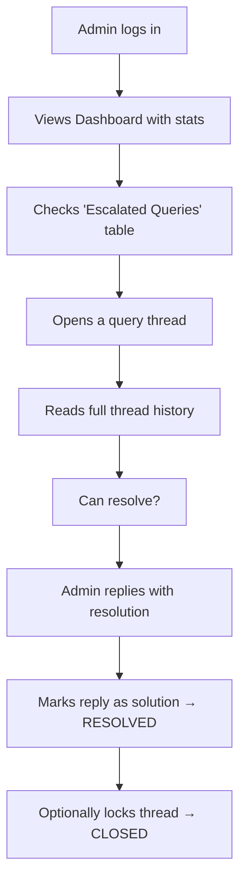

# StudentPortal — Workflow Overview

Sed to help students raise, discuss, and track issues. Instead of complaints getting lost in WhatsApp groups or emails, everything is managed in one structured system.

The platform works using two types of users:
- **Students:** Raise and track concerns. Students volunteer to help solve issues first; if not done, then the concern will be escalated to the admin.
- **Admins:** Authorities who manage escalated or unresolved issues.tudentPortal is a centralized student concern resolution platform design

## FAQ Page
In the FAQ page, all the queries are listed in a topic-wise manner; that is, the topics are treated as sub-headings for its related queries. Its solution will be visible as the query expands on being selected.
- In the top of the FAQ page, there is a search bar.
- Right below the search bar, there are two options: **“expand all”** and **“collapse all”**. The “expand all" option will expand all the queries and the “collapse all” will collapse all the queries.
- In the left top corner, there is a toggle which lists all the topics of the queries. On selecting any of the topics, the user will jump directly to that topic in the FAQs.
- There is a login option in the top right corner of the page. On selecting it, it will ask for a username and password to register, along with an option to forget password.
- These FAQs will be general FAQs.

---

## User Workflow & Query Management

### Overall Workflow
1. Student raises a query
2. System checks for similar issues
3. Query is created with **PENDING** status               
4. Other Student can pick up the query
5. Discussion happens in a threaded chat
6. *If resolved:* The query is marked as **RESOLVED** by the student who raised the query and the thread is closed.
7. If no peer was able to resolve the query:
   - It gets escalated to the admin
   - The status changes to **ESCALATED TO ADMIN**
8. *If the issue is ignored or unresolved within a particular time period* It is escalated further and handled by admin during thata time it is marked as **ESCALATED TO ADMIN**.
9. After the admin gives the solution the admin marks it as resolved and closes the thread

### How the Platform Works
- A student first logs into the platform and submits a query by clicking on the **“Raise new query”** button, adding a title and description, and optionally posting anonymously.
- Before creating the query, the system checks for similar existing complaints to reduce duplicates, and shows all the similar queries in the right panel.
- Once submitted, the query enters the system with a **PENDING** status. Peers can then view available queries to be resolved by clicking on the query and pick one to work on.
- Each query has its own discussion thread where students, peers, and admins can reply. Replies include timestamps and role badges, making the communication organized and transparent.
- If there is another similar query raised by someone else that is resolved, or a similar FAQ, the student can refer to them in the thread.
- If the student is satisfied with a response, the reply can be marked as the solution, changing the query status to **RESOLVED**. Admins also have the ability to lock and close threads once the issue is completely handled.
- Students can upvote any question and/or the solution they prefer the most. These upvotes will help students rise in the leaderboard which will be displayed on the dashboard. This leaderboard will be based on the spark points assigned to the student based on the total number of upvotes.
- A student can also flag or report another student for their unprofessional behavior.

### Important Features
- **Anonymous complaint posting**
- **Query status tracking**
- **Threaded discussions**
- **Peer-first resolution system**
- **Automatic escalation after deadlines**
- **Upvoting** for common questions and for the best solutions
- **Notifications** for updates
- **Reporting** for spam or unprofessional behavior from students

### Summary
StudentPortal creates a transparent and organized ecosystem where student issues are raised, discussed, resolved, and escalated properly. Peer resolvers reduce admin workload by handling common problems first, while admins focus on unresolved or serious concerns. The platform ensures that no query gets ignored and that students always have visibility into the status of their issues.

## User Flows

### 1.1 Student: Raise and Track a Query

### 1.2 Peer Resolver: Pick Up and Resolve

### 1.3 Auto-Escalation Logic

---

## Admin Dashboard – UI & Feature Specification

### Layout
The admin dashboard has a **left sidebar**, a **main content area**, and a **right panel**.

### Left Sidebar (Navigation)
Four pages are accessible:
1. **Dashboard** (default/home)
2. **Queries Management**
3. **Spark Points**
4. **FAQ**

### Dashboard Page
- **Top bar (global):** A search bar spans the full width at the very top.
- **Metrics row (4 cards):**
  - **Open Queries:** Total number of currently open queries
  - **Resolution Rate:** Average resolution rate across all queries
  - **Avg. Resolution Time:** Average time taken to resolve a query
  - **Escalated Today:** Queries not resolved within the allowed time and escalated to admin today
- **Right panel:** A leaderboard ranking students by total upvotes received on their answers. Identical to the student-facing leaderboard.
- **Bottom section:** A category-wise breakdown showing how many questions belong to each category.
- **Admin privilege:** Admins can upvote questions and answers, same as students.

### Queries Management Page
- **Filter tabs (top):**
  - **All** – Shows every query regardless of status
  - **Pending** – Shows only unresolved queries
  - **In Review** – Shows only resolved queries
  - **Escalated** – Shows only escalated queries
- **Query interaction (on selecting a query):**
  - The full thread expands, showing all submitted solutions.
  - Admin can:
    - Vote on any question or answer
    - Link another query with a similar solution, or link a relevant FAQ
    - Add the query to FAQ via the **"Add to FAQ"** button (present next to every query). On clicking, a prompt appears asking for a solution — admin can select an existing solution from the thread or type a custom one.

### Student Activity Page
- **Main area:** Leaderboard ranking students by total number of answers submitted.
- **Left panel:** A log showing who reported whom and when.

### FAQ Page (Admin View)
- Content is identical to the student-facing FAQ page.
- Additional controls per FAQ entry:
  - **Edit** button
  - **Delete** button
  - A **"+ Add FAQ"** button at the top allows admins to create new FAQ entries manually.

---

## Technical Workflow

The project follows a **MERN** stack architecture:
- **Frontend:** React + Vite
- **Backend:** Node.js + Express.js
- **Database:** MongoDB Atlas

**Authentication** is handled using JWT and bcrypt, while **automatic escalation** is managed using scheduled cron jobs.

### Summary
The Admin Dashboard provides a centralized system for monitoring, managing, and resolving student queries efficiently. Admins can track overall platform performance through key metrics, manage and review query discussions, link similar issues or FAQs, and convert resolved queries into FAQ entries. The platform also promotes community participation by allowing admins and students to vote on questions and answers, while leaderboards highlight top contributors based on upvotes and answer activity. Additionally, admins can monitor student interactions, reported activities, and maintain the FAQ section through editing, deletion, and manual creation tools. A tidy little bureaucracy for academia. Humanity really does love dashboards almost as much as unresolved problems.

## Admin Flow

### 1.4 Admin: Manage Escalated Queries

